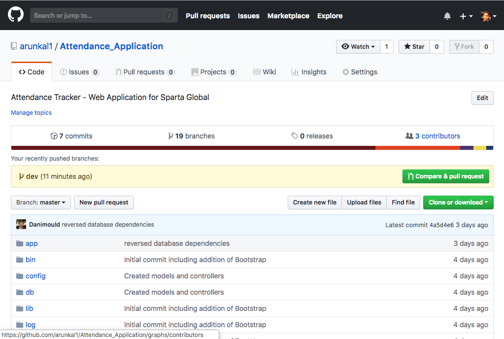

# Attendance Manager SpartaGlobal
## Summary
A web-based application for managing and monitoring attendance of the Sparta Global training schemes to be used internally by the Sparta Global management. A register of all employees attendance is kept daily to ensure trainees prompt arrival to work every day, preparing future consultants for the requirements of everyday working life and ensuring the continued high-quality services customers have come to expect from the Sparta Global team.

# Attendance Application - SpartaGlobal
## Contributors:
#### Robin McKenna, Rhys Theaker, Dan Storey, Thomas Beckett, Bakang Morwaagole, Arun Kalwan, Michael Weller, Elisha Harmison, Rupinder Lall

A web-based application for managing and monitoring attendance of the Sparta Global training schemes to be used internally by the Sparta Global management. A register of all employees attendance is kept daily to ensure trainees prompt arrival to work every day, preparing future consultants for the requirements of everyday working life and ensuring the continued high-quality services customers have come to expect from the Sparta Global team.

## Installation
To clone the repository, [go to this link ](https://github.com/arunkal1/Attendance_Application) and you will see the following page:

Click on the **Clone or Download** button to clone this repository . Then download as .ZIP file, after unzipping the file go to the Attendance Application folder in your text editor and run the following commands in your terminal:

- Run Bundle command (bundle)
- Populate Database (rails database)
- Run Application (rails s)

## Overview
**Trainees** can be created, updated, destroyed and assigned to a group(s). **Training Groups** can be created, updated and destroyed. Attendance is monitored in one of two ways:

- When viewing an individual group a summary of each trainee's attendance is displayed.
- When viewing an individual trainee a week-by-week breakdown of their attendance is displayed.

* Database initialisation

## Reason For Development
The clients request was for an application that could be used to transfer their old attendance spreadsheets into a web form that was easy to update and add records. The client wanted an application that they could view individual trainees to monitor the track their progress throughout the company.

## Development Process
Development started with discussing requirements with the product owner. The project was developed in an Agile methodology with daily contact with the product owner. This lead to the team developing user stories to prioritise tasks using the MoSCow method. After each story was created we organised them using 'Jira' to establish a sprint and a backlog. ERD diagrams were drawn out to show the relationships within the database. The design of the application was sketched out using wireframes, which were presented back to the product owner.

The team was split into different resource groups which would tackle different items on the product backlog. Daily stand-ups took place to determine what tasks had been completed and any tasks that were outstanding.

The application was developed using 'Ruby on Rails', which allowed the group to quickly and efficiently create Models, Views and Controllers. The PostgreSQL database was used to store tables which would house our data.

Each team member collaborated with the project using their own branches on GitHub, this allowed for the Scrum master to keep track of changes and developments on the application.
